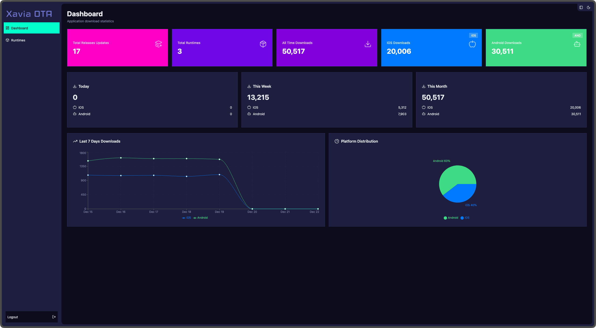
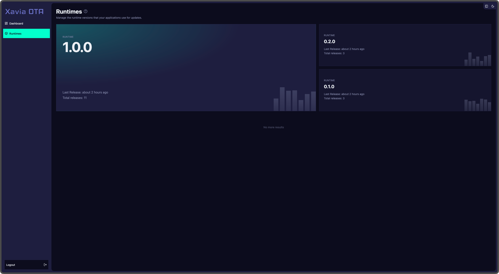
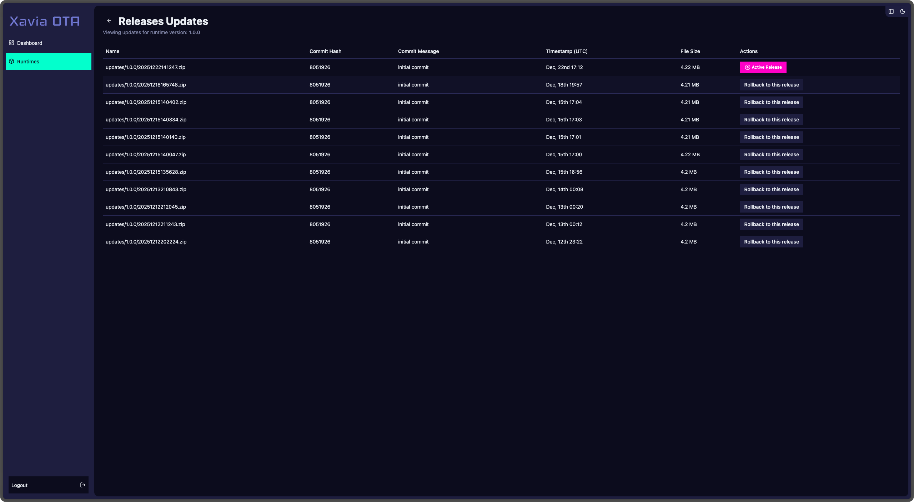

# Admin Portal Documentation

The admin portal provides a web interface for managing your OTA updates. 

## Authentication

Be sure to create an user to login in the dashboard

### Create user

1. Check your environments for better auth 
   - Set `DISABLE_SIGNUP=false`, disabled by default on production
   - Also set `BETTER_AUTH_SECRET` and `BETTER_AUTH_URL` [docs](https://www.better-auth.com/docs/installation#set-environment-variables)

2. Provide your credentials
 - Go to https://yourhost.domain/sign-up
 - or while running your server run
    ```bash
    bun run auth:signup
    ```

Once you are setup you can (and should) disable signup by setting `DISABLE_SIGNUP=true` on your env variables

## Dashboard Overview



The main dashboard provides:
- Total number of releases updates
- Total number of runtimes
- Total number of downloads for all platforms
- Total number of downloads by platform
- Total downloads overtime

## Runtimes Overview



The runtimes page provides:
- List of all runtimes versions for updates uploaded
- Brief summary of the most recent update date and total updates


## Publishing and Rolling Back Updates



The release updates page provides:
- List of all updates for a runtime with metadata
- Rollback functionality to a previous update
